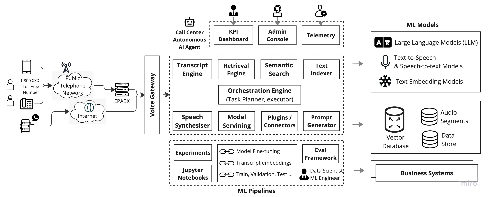
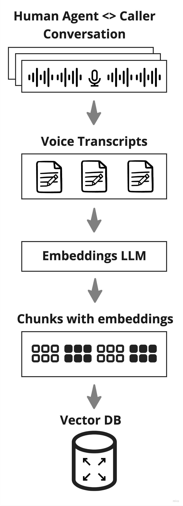
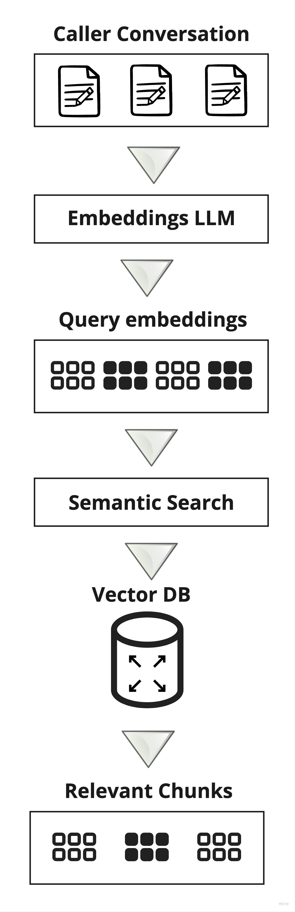
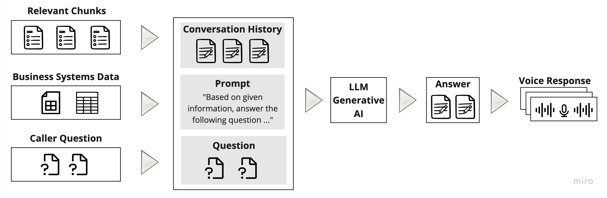
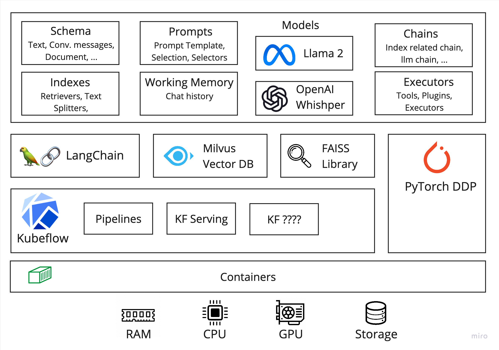

## :telephone_receiver: Design a AI-driven Voice based Customer Conversation System :robot:

### System Design Interview - Problem Statement

Here is my understanding (or) transcript :pencil2: of the problem statement :question: prescribed, as an assignment over call. :calling:

#### :hourglass: Background

A fictitious company provides customer support services to multiple clients. Until now, calls were answered by human agents. Due to the increasing volume of calls and the need to streamline the support process, the company wants to deploy an AI BOT to handle these conversations over IP telephony.

####  :open_book: Requirements

1. The system should receive IP-based calls where customers describe their issues, concerns, or tasks in natural language.
2. AI BOT should answer every customer call.
3. The AI BOT must determine the customer's intent by analyzing the voice conversation.
4. The system should be able to record the call, generate a transcript, and measure the BOT's understanding quality.
5. The BOT's response to the customer should be derived from previous human agent responses to similar queries, issues, or concerns.
6. The system have access to a corpus of previous human agent voice conversations and transcriptions.
7. The AI BOT can also query other business systems to compose a data-driven response.
8. The system should measure metrics that would be of interest to company executives (CXOs) and evaluate the overall performance and efficiency of the platform.

#### :scroll: Constraints

1. The system should be hosted on public cloud preferably Google Cloud.
2. Solution can leverage open-source software and AI/ML models. If needed adopt Commercial-off-the-Shelf (COTS) tools and cloud provider SaaS services.

#### :toolbox: Ask

Design an AI BOT solution to handle these conversations over IP telephony. The proposed system design should capture following,

1. A high-level architecture diagram of the system.
2. A detailed explanation of each component in the system.
3. Process & Data flow diagrams showing how data moves between components.
4. List out the technologies choosen to implement the solution. Justification for technology choices made.
5. A strategy to ensure high availability, scalability, and security of the system.
6. Potential challenges and their proposed solutions.
7. Design storage and search mechanisms for the transcripts and voice recordings.

## :rocket: Solution :100:

This document captures h**igh-level solution** of _re-engineered_ and _re-architected_ solution that replaces existing human-agent centric customer support call centre with :brain: an **AI/ML driven**, :robot: **BOT oriented**, 🚀 **scalable**, 〰️ **elastic** & 🏢 a **multi-tenant** autonomous call centre solution.

* The 🎡 **To-Be System Architecture** is explained through various architecture views such as ```Functional Architecture, Technical Architecture, Deployment Architecture, Component Designs, Technology Choices``` and more, each addressing unique concerns of various stakeholders & audience.
* Highlights how the proposed solution addresses limitations & constraints for current system with modern AI technology advances.

### Functional Analysis & Design

A quick use-case analysis has yielded essential buisness functions which are mapped into system fuctions. Related system functions are grouped into functional modules later to be translated into software components.

| Functional Module | Description | Critical System Functions|
| --- | --- | --- |
| Voice Gateway | 
|
| 

#### Non-Functional Requirments
Solution should adhere to folloiwng NFRs,

1. Low-latency: Being a voice based conversational system, it should process requests in sub-second, so that caller should not feel any delay.
2. Multi-language: Support multiple spoken languages, should detect language automatically and reply in same language.
3. Should have gaurdrails against toxcity, bias.
4. 

Performance Assurance section below highlighs how some of the above NFRs are met.

### Solution Architecture

AI has become more ubiquitous in every software product including contact centers. As AI technology continues to develop, more and more contact centers are using AI to improve customer service. Unlike previous rule-based ML models, Generative AI has great capacity to solve the challenges of contact centers, both improving customer experience and increasing efficiency among human agents.

The proposed solution takes advantage of Gen AI technology to improve contact center opertions through AI-enabled virtual assistants. The solution embraces LLM powered AI agents to augment the work of call center agents throuugh “task orchestration” to make contact center work more efficient.

The LLM powered agents can control of the customer conversation, without having to transfer the interaction to a live agent, and the customer is able to complete their task with self-service without even being aware of the AI-agent collaboration happening.

Below diagram depicts critical subsystems and components in the solution,



Click here to modify [Miro](https://miro.com/app/board/uXjVMrUCYIg=/?share_link_id=799154363440) diagram.

Generative AI LLM models has capability to maintain context throughout an interaction. LLM powered autonomous agents can scour through your previous human-agent transcript knowledge bases. AI powered autonomous Agents can instantly be brought up to speed by accessing full historic interaction transcript.

The solution includes below architectural significant components,

| Subystem / Component | Description | Component Design |
| --- | --- | --- |
| **Channel Gateway** | An unified routing engine that handles all kinds of traffic such as voice and instant messaging ???? | ??? |
| **Transcript Engine & Speech Synthesiser** | Turns audio segments into natural language transcripts and vice versa. It uses speech-to-text and text-to-speech ML models. | |
| **Semantic Search & Retrieval Engine** | Performs semantic search on text corpus indexed in vector databases. These engines does transcript splitting, generate embeddeings through text embedding models, index & store embedding chunks in vector databases. the also use semantic search algorithms to retireive relvant transcript chunks for given text context.||
| **Orchestration Engine** | A central task planning, sequencing and execution engine. It is powered by autonomous LLM agent frameworks such as LangChain or LlamaIndex or others. It processes user queries by chaining various tasks which includes audio to text conversion, retrieving relvant documents, prompt selection, generate response and convert into audio. It includes various connectors/plug-ins/tools to perform the tasks.||
| **ML Pipelines** | A collection of pipelines for LLM model fine-tuning, training, valiation and testing. Pipelines for preparing & updating training corpus by using past human-agent & customer audo recordings. Pipelines to populate Vector database and indexing content. | ? |
| ML Models & Datat Stores | The solution uses various ML models such as Generative AI LLM models, Text Embeddings Models, Text-to-Speech & Speech-to-Text models. The solutions uses Vector DBs, Distributed Caching Stores, Audi Segments Storage uints.| ? |

processes,

Training Corpus

Past customer & human-agent conversation voice segments
Past customer & human-agent transcript knowledge bases

Model Fine-tuning

Model Evaluation & Live Experimentation




Click here to modify [Miro](https://miro.com/app/board/uXjVMrUCYIg=/?share_link_id=799154363440) diagram.



Click here to modify [Miro](https://miro.com/app/board/uXjVMrUCYIg=/?share_link_id=799154363440) diagram.



Click here to modify [Miro](https://miro.com/app/board/uXjVMrUCYIg=/?share_link_id=799154363440) diagram.

### Technical Architecture



Click here to modify [Miro](https://miro.com/app/board/uXjVMrUCYIg=/?share_link_id=799154363440) diagram.

#### Component Designs

Contact centers has to train ML models to their 

Better part ot training would be prompt engineering, to tune prompts for good auto summarization with given context.


#### Process Flows & Information Models 

### Deployment Architecture

### Performance Assurance

### Security Architecture, Privacy and Compliance

#### References

