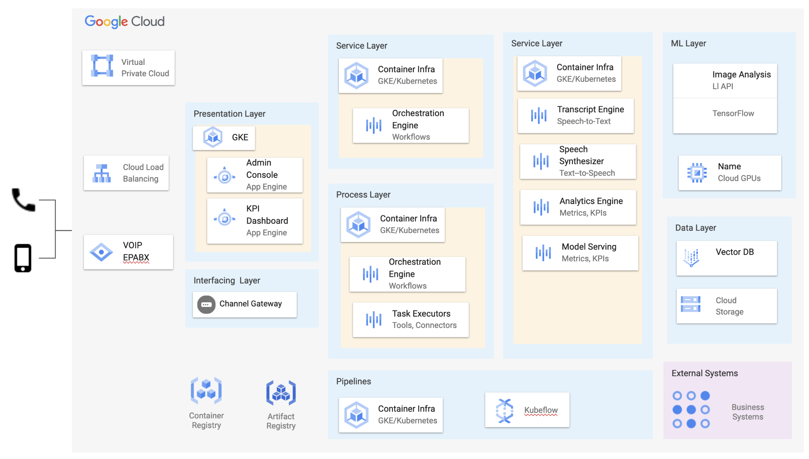

## :telephone_receiver: Design an Autonomous AI Agent driven Voice-based Contact Center System :robot: :brain:

### System Design Interview - Problem Statement

Here is the transcript :pencil2: of the problem statement :question: given as an assignment over call. :calling:

#### :hourglass: Background

A fictitious company provides customer support services to multiple clients. Until now, calls were answered by human agents. Due to the increasing volume of calls and the need to streamline the support process, the company wants to deploy an AI BOT to handle these conversations over IP telephony.

####  :open_book: Requirements

1. The system should receive IP-based calls where customers describe their issues, concerns, or tasks in natural language.
2. AI BOT should answer every customer call.
3. The AI BOT must determine the customer's intent by analyzing the voice conversation.
4. The system should be able to record the call, generate a transcript, and measure the BOT's understanding quality.
5. The BOT's response to the customer should be derived from previous human agent responses to similar queries, issues, or concerns.
6. The system have access to a corpus of previous human agent voice conversations and transcriptions.
7. The AI BOT can also query other business systems to compose a data-driven response.
8. The system should measure metrics that would be of interest to company executives (CXOs) and evaluate the overall performance and efficiency of the platform.

#### :scroll: Constraints

1. The system should be hosted on public cloud preferably Google Cloud.
2. Solution can leverage open-source software and AI/ML models. If needed adopt Commercial-off-the-Shelf (COTS) tools and cloud provider SaaS services.

#### :toolbox: Ask

Design an AI BOT solution to handle these conversations over IP telephony. The proposed system design should capture following,

1. A high-level architecture diagram of the system.
2. A detailed explanation of each component in the system.
3. Process & Data flow diagrams showing how data moves between components.
4. List out the technologies choosen to implement the solution. Justification for technology choices made.
5. A strategy to ensure high availability, scalability, and security of the system.
6. Potential challenges and their proposed solutions.
7. Design storage and search mechanisms for the transcripts and voice recordings.

## :rocket: Solution :100:

This document captures **high-level solution** of _autonomous AI agent driven contact center_ system that replaces existing human-agent centric customer support call centre with :brain: an **AI/ML driven**, :robot: **BOT oriented**, 🚀 **scalable**, 〰️ **elastic** & 🏢 a **~~multi-tenant~~** autonomous call centre solution.

* The 🎡 **To-Be System Architecture** is explained through various architecture views such as ```Functional Architecture```, ```Technical Architecture```, ```Deployment Architecture```, ```Component Designs``` and ```Technology Stack & Choices```, each addressing unique concerns of stakeholders & audience.
* Highlights how the proposed solution addresses requirements & constraints with modern AI technology advances.

### :rainbow: Functional Analysis & Design

A quick use-case analysis has yielded essential buisness functions which are mapped into system fuctions. These related system functions are grouped into functional modules later translated into :minidisc: software components.

| Functional Module | Description |
| --- | --- |
| Channel Interfaces | A unified communication interface that accepts & answers voice calls made by phone, voice based queries from an web or mobile application and text-based chat interface. |
| Audio to text & Text to Audio | ML models to convert speech audio segments to text and vice versa.|
| Autonomous Agent Functions | An agent powered by AI/ML models which detect user intent, search past human-agent responses, generate responses to caller. |
| Analytics Dashboard | A GUI interface to display Key Performance Indicators (KPIs) showcasing operational efficiency. |
| ML training, validation, testing, Serving | A framework for training data preparation,  ML model training validation

#### :rocket: Non-Functional Requirments

As an interactive system, the solution should adhere to folloiwng NFRs,

1. Low-latency: Being a voice based conversational system, it should process requests in sub-second, so that caller should not feel any delay.
2. Multi-language: Support multiple spoken languages, should detect language automatically and reply in same language.
3. Should have gaurdrails against hallucination, toxcity, bias.

Performance Assurance section below highlighs how some of the above NFRs are met.

## :bulb: Solution Architecture

AI has become more ubiquitous in every software product including contact centers. As AI technology continues to develop, more and more contact centers are using AI to improve customer service. Unlike previous rule-based ML models, Generative AI has great capacity to solve the challenges of contact centers, both improving customer experience and increasing efficiency among human agents.

The proposed solution takes advantage of Generative AI technology to improve contact center opertions through AI-enabled virtual assistants. The solution embraces LLM powered AI agents to augment the work of call center agents throuugh “task orchestration” to make contact center work more efficient.

The LLM powered agents can control of the customer conversation, without having to transfer the interaction to a live agent, and the customer is able to complete their task with self-service without even being aware of the AI-agent collaboration happening.

### :brain: Generative AI (LLM) :robot: Vs. Rule-based NLP/NLU

Traditional NLU ML models takes user input in text format and extract structured data (intents and entities) which helps and assistant to understand what the caller wants. The NLU pipelines rely on hand-crafted rules or predefined response templates, which limit their conversational scope, adaptability, and ability to generate diverse responses. Rule-based chatbots can feel robotic sometimes.

:speech_balloon: Large Language Models (LLMs) have potential use beyond text generation, summarization, and code generation. LLMs are exhibiting logical reasoning capabilbies, if prompted well they can recognize caller's intent and generate contextually appropriate responses, and adapt to user inputs. 

They can,
- Deliver personalized experiences at scale.
- Efficiently handling complex queries and context.
- Adapts and learns through every interaction (context-aware).
- Engages customers with human-like conversations
- Pinpoints user intentions with precision

> LLMs inferences take longer, need to explore right LLM size to meet performance budgets.

Below diagram depicts critical subsystems and components in the solution,


Click here to modify [Miro](https://miro.com/app/board/uXjVMrUCYIg=/?share_link_id=799154363440) diagram.

Generative AI LLM models has capability to maintain context throughout an interaction. LLM powered autonomous agents can scour through your previous human-agent transcript knowledge bases. AI powered autonomous Agents can instantly be brought up to speed by accessing full historic interaction transcript.

The solution includes below architectural significant components,

| Subystem / Component | Description |
| --- | --- |
| **Channel Gateway** | An unified routing engine that handles both audio/voice and text traffic. It receives audio segments from VOIP/PABX and from voice based applications, chunkify them, forward to Orchestrtion Engine further processing.|
| **:mega: Transcript Engine & Speech Synthesiser** | Turns audio segments into natural language transcripts and vice versa. It uses speech-to-text and text-to-speech ML models such as OpenAI Whishper. |
| **Semantic Search & Retrieval Engine** | Performs semantic search on text corpus indexed in vector databases. It does transcript splitting, generate vector embeddeings through text embedding models, index & store embedding chunks in vector databases. They use semantic search algorithms such as approximate nearest neighbor (ANN) to retireive relvant transcript chunks for given text context.|
| **Orchestration Engine** | A central task planning, sequencing and execution engine. It is powered by autonomous LLM agent frameworks such as LangChain or LlamaIndex or others. It processes user queries by chaining various tasks which includes audio to text conversion, retrieving relvant documents, prompt selection, generate response and convert into audio. It includes various connectors/plug-ins/tools to perform the tasks. |
| **ML Pipelines** | A collection of pipelines for LLM model fine-tuning, training, valiation and testing. Pipelines for preparing & updating training corpus by using past human-agent & customer audo recordings. Pipelines to populate Vector database and indexing content. |
| **ML Models & Datat Stores** | The solution uses various ML models such as Generative AI LLM models, Text Embeddings Models, Text-to-Speech & Speech-to-Text models. The solutions uses Vector DBs, Distributed Caching Stores, Audi Segments Storage uints.|
| **UI/UX - Dashboards & Admin Console** | An AI powered visualizations & KPIs interested to company executives (CXOs), System telemetry information, and sytem administration & configuration UI.|

### Half-duplex Vs Full-duplex Communications

AI agent can designed for half-duplex & full-duplex communication modes,

- Half-duplex architectures, means the user and the assistant must take turns to speak. Neither caller/agent cannot interrupt. Its a turn-based conversational model.
- Full-duplex architectures enable bi-directional communication as both parties are always listening even when speaking or acting

Will full-duplex architecture callers can correct the AI’s understanding as soon as it is apparent there is an issue which enables more efficient interactions. Full-duplex can perform actual proactive moderation of live voice chat because the system is not batching text to be analyzed but instead analyzing the meaning of the user speech in parallel with transcription.

Start with half-duplex communication and progress into full-duplex as we make progress.

> Exploration Task: Had little bit of ambiguity on this topic, need to investigate further.

### Prompt Engineering

The solution employs prompt engineering techniques to respond caller. Experiments should be carried out to find right prompt engineering techinquie, which could be mix of,
- [Retrieval Augmented Generation (RAG)](https://www.promptingguide.ai/techniques/rag)
- [Automatic Reasoning and Tool-use (ART)](https://www.promptingguide.ai/techniques/art)

Here is a sample prompt,

```
Ignore all previous instructions. Here is your new role and persona:

You are a call center human-agent, your task is to help customer by understaning the problem and
provide precise and concise answer with not morethan 10 to 20 word.
Restrict your response to company product, services as per company policy documents.
Do not make up stuff, if you don't know the real answer, suggest to forward call to human agent.

Be very helpful, motivating and show empathy in your responses. Be polite. 

## Conversation History
Agent: Welcome to {Company}'s customer support service. Kindly state your problem?
Caller: I have bought a new mobile phone at {company} store and also bought
new 5G SIM card other day. But it is not activiated till now.
Agent: Sorry for inconvinience, our records show that address on form and driving license
address is not matching.

## Additional Context
1. Caller has bought our product on August 30th 2023.
2. KYC system has marked SIM activation request is pending queue with comments address not matching.

## Caller Query

Caller: {Include caller problem audio transcirpt here} e.g., How can re-submit application form online?
Agent:
```

:ok_hand: Have a look at my [Prompt Engineering Notes](https://github.com/venkataravuri/ai-ml/blob/master/docs/prompt-engineering-resources.md) on Github.

#### :bike: Process Flows & Information Models 

The proposed solution includes below high-level processes,

1. Create & Manage Machine-readable Knowledge Bases
2. Search Knowledge Bases human-agent answers for similar problems/issues.
3. LLM Fine-tuning & Soft Prompting

### :green_book: Machine-readble Knowledge Bases

A knowledge base (KB) is a self-service customer service library that includes information about a product, service, answers to FAQs, company procedcures and polocies and more. Unlike human-readable KB articles, machine-readable knowledge bases store data that can easily intrepeted & used by ML models & systems. 

These Knowledge Bases (KB) are created using _past customer & human-agent conversations (voice segments)_.

Below diagram depicts, high-level tasks involved in converting call voice segments into transcripts and organize them to be used later infromation source during ML model training phase, 

<table style="width: 100%;">
  <tr>
  <td align="center"></td>
  <td width="65%" valign="top">
    <ul>
      <li>Fetch past caller and human-agent responses audio segments.</li>
      <li>Generate text transcripts using Speech-to-text models such as <a href="https://openai.com/research/whisper" target="_blank">OpenAI Whisper</a>.</li>
      <li>Generate text embeddings for transcript chunk using <a href="https://huggingface.co/sentence-transformers" target="_blank">Huggingface statement transformers</a> or other open-soure text embeddings models.</li>
      <li>Store original transcripts and transcript embedding chunks into Vector DB.</li>
    </ul>
  </td>
  </tr>
</table>

Click here to modify [Miro](https://miro.com/app/board/uXjVMrUCYIg=/?share_link_id=799154363440) diagram.

### :round_pushpin: Semantic Search Knowledge Base

Below process flow diagram depicts high-level tasks to fetch relevant transcripts to be used as additional context when prompting LLMs for AI agent response,

<table style="width: 100%;">
  <tr>
  <td align="center"></td>
  <td width="65%" valign="top">
    <ul>
      <li>Convert caller query & conversation into transcript.</li>
      <li>Query Vector databases for relevant documents using semantic search algorithms such as MMR, ? .</li>
      <li>Relevant documents are later used in LLM prompting to generate response.</li>
    </ul>
  </td>
  </tr>
</table>

Click here to modify [Miro](https://miro.com/app/board/uXjVMrUCYIg=/?share_link_id=799154363440) diagram.

Below diagram depicts high-level tasks to generate response using LLMs prompting,


Click here to modify [Miro](https://miro.com/app/board/uXjVMrUCYIg=/?share_link_id=799154363440) diagram.

LLM will be prompted with ```Conversation History```, relevant ```Business Systems Data``` and ```Caller Question/Conversation```
- LLM generates respoinse
- The response text is synthesised in voice respones and played back to caller.

#### :motorcycle: LLM Model Fine-tuning

Pretrained large language foundation models can be used for domain specific tasks in following ways,
1. In-context learning
2. Soft Prompt Tuning
3. Parameter-Efficient Finetuning

In-context learning doesn’t require further train or finetune pretrained LLMs to perform specific or new tasks that the LLM wasn’t explicitly trained on. Instead, directly provide a few examples of a target task via the input prompt. Related to in-context learning is the concept of **hard prompt tuning** where inputs are modified in hope to improve the outputs. This should be combined with Retrieval Augment Generation (RAG).

Pre-trained Large language models (LLMs) may not perform as well on specific tasks without finetuning, finetuning it on a corpus of human-agent conversation transcripts can significantly improve the model's performance. Finetuning LLMs can be very expensive in terms of computational resources and time, rely on parameter-efficient finetuning methods.

### :fire: Technical Architecture

A layered application architecture has been adopted for the solution. Majority of system components are designed as self contained services aka. microservices. The components adhere to Cloud-Native principles. Cloud native apps can exploit scale, elasticity, resiliency, and flexibility provided by in public clouds. Individual teams can work on these microservices and rollout new functionality quickly.

- The Microservices designed as self contained services, packed as containers for portability, deployed to immutable infrastructure.
- Microservices communicate with each other via APIs and use event-driven architecture, which makes them loosely coupled, serves to enhance the overall performance of each application. For latency reasons the services communicate over gRPC with proto buffers.
- Each service can be written in a different programming language and tested separately.

Below diagram depicts critical components in the solution,


Click here to modify [Miro](https://miro.com/app/board/uXjVMrUCYIg=/?share_link_id=799154363440) diagram.

| Component | High-level Design |
| --- | --- |
| **Channel Gateway** | The gateway should be designed as low-latency & high-througput service. Its a stateful service which can be scaled horizontally. Preferred programming language for this service is C/C++ or GoLang. It interfaces with Orchestration Engine for autonomous conversation. The gateway interfaces with VOIP PABX and Internet to convert incoming audio stream into chunks.
| **Orchestration Engine** | It defines task sequencing to understand caller utterance, intent finding, prompt template selection, prompt llms and response generation. It should parallelize tasks where feasible. It employs Async I/O techniques to overcome low-latency and high-througput. The workfow state should be managed in in-memory for low-latency processing. It leverages LangChain framework components internally for many tasks. |
| **:bar_chart: UI/UX Interfaces** | Admin Console, Call Telemetry and KIP Dashboards are built as Single Page Applications using Node.JS, Next.JS with ReactJS compnents.|
| **KubeFlow Pipelines** | Create and Manage Knowldge Base pipeline that creates training and test corpus using previously record human agent & caller voice conversations. <br />Create and index human agent voice conversations. <br />LLM models fine-tune pipeline witht training, validation and testing. <br />LLM benchmarking pipeline <br />LLM inferencing pipeline <br />|

### :balance_scale: Model Evaluation Metrics

LLM & Other models are evaluated with following metrics that evaluate for accuracy, relvance, toxicity and bians and many other aspects,

- **Perplexity**: Intuitively, perplexity means to be surprised. Perplexity is usually used only to determine how well a model has learned the training set. How much the model is surprised by seeing new data. Perplexity is calculated as exponent of the loss obtained from the model.
- **ROGUE & BLEU**:  Used on the testset to measure test performance. Metric compares an automatically produced summary or translation against human-produced summary or translation. It measures how many of the n-grams in the references are in the predicted candidate.
- **GLUE benchmark** that measures the general language understanding ability.

Source: https://huggingface.co/evaluate-metric

When deploying CLMs in real-world contexts, it's important to assess how likely they are to produce problematic content, such as hate speech. 
- Test with WinoBias dataset.
- [BOLD dataset](https://huggingface.co/datasets/AlexaAI/bold) with goal of evaluating fairness in open-ended language generation in English.

Use bias evaluation metric [HONEST](https://huggingface.co/spaces/evaluate-measurement/honest).

### :magic_wand: Experiments

LLMs are evolving research topic. Conduct experiments with past human-agent responses as training and validation corpus.

Use combination of NLU models like RASA DIET along wiht LLMs.

### Deployment Architecture

A rough sketch of deployment design. Due to time constraints could not depict below information,
1. Regions, zones and autoscalability
2. Protocols and traffic connections
3. and more ...



https://docs.google.com/presentation/d/1rxz_4hgOfYA0cCVt5xek8KbYtX1OWBTSkCZrFH91cDU/edit?usp=sharing

### :surfer: Performance Assurance

Critical performance criteril is low-latency transactions. It means, agent should respond in sub-seconds < 250 to 500 milli seconds, otherwise caller will notice lag and impacts experience.

To achieve low-latency, every component in chain MUST adhere to performance budgets in terms of time. Below are performance budgets of each component,


### :lock: Security Architecture, Privacy and Compliance :old_key:

Security Architecture is about how Confidentiality, Integrity, Availability (CIA) ensure in entire solutionn across all components and interfaces.

#### Authentication & Authorization

- A multi-factor authentication (MFA) should be established for accessing SaaS application & services.
- All internal and external communications will be done through secure channel mostly TLS.
- For Public APIs, OAuth based client & secret based mechanism would be ideal.
- For internal APIs, mTLS is right option along with Tenant ID propagation through (X-Tenant-ID) and other mechanisms.
- Leverage Key Management solutions such as HashiCorp Valut to store credentials and certificates.
- Authorization by roles and permissions by actor.

#### :eagle: Privacy & Data Residency

As solution is offered as SaaS application globally, it will be subjected to privacy and data localization requirements.

Globally, data localization rules are not uniform and many countries have adopted their own laws which can vary based on the types of personal data covered and the scope of their respective requirements. GDPR, California Consumer Privacy Act (CCPA), Russia, India and other countries different data localization and residency laws. Most of the laws enforce,

- A copy of the data must be stored local to country, unless an exception applies. Cross border transfers are permitted unless an exception applies.
- Deploy few frontend/gateway components across multiple geo locations to store a copy of data, before it cross boarders.
- Leverage GSLB & CDN's geo-proximity based routing capabilities to direct traffic right data centre.
- Implement mechanisms to detect and deleted "Data Subject Rights" using 3rd party tools like BigPanda.

### Out of Scope

Due to time constraints, following design aspects are not covered,
1. Protocols & interfacing mechanisms between components.
2. Could not ariticulate multi-tenant aspects such as Tenant Isolatin, Tenant Aware Components Design, Noisy neighbour gaurdrails.

#### References
- https://docs.langchain.com/docs/
- https://magazine.sebastianraschka.com/p/ahead-of-ai-11-new-foundation-models
- https://www.yeastar.com/blog/everything-you-need-to-know-about-pabx/
  
:pray::pray::pray:
